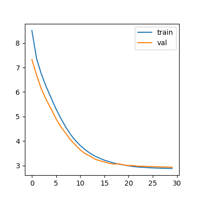
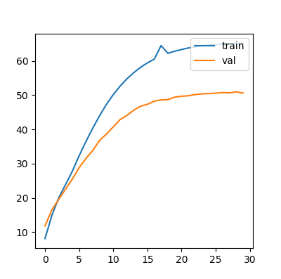

# Transformer-backbone
This is the reproduce of Transformer architecture in paper ["Attention is all your need"](https://arxiv.org/abs/1706.03762). 
The aim of this repository is to help those who want an insight to the details of Transformer realization, without being bothered with data preprocessing.    
The structure of Transformer is illustrated as bellow  


Thus, we build the network hierarchically. From the top to bottom level is  

Transformer--Fused_Embedding Encoder Decoder--Encoder_layer Decoder_layer--Multiheaded Attention PositionWise_FeedForwardNetwork  

the tree structure is shown as bellow:  

-_Transformer.py_  
>--_Fus_Embeddings(AggregationModel.py)_  
  >>-- _word Embedding Vectors_    
  >>-- _Positional Encoding(Modules.py)_  
  
>--_Encoder(AggregationModel.py)_  
  >>-- _Encoder Layer(Model.py)_  
    &nbsp;&nbsp;&nbsp;-- _MultiHeadedAttention(Modules.py)_  
    &nbsp;&nbsp;&nbsp;-- _PostionWiseFFN(Modules.py)_
  
>--_Decoder(AggregationModel.py)_  
  >>-- _Decoder Layer(Model.py)_  
    &nbsp;&nbsp;&nbsp;-- _MultiHeadedAttention(Modules.py)_  
    &nbsp;&nbsp;&nbsp;-- _PostionWiseFFN(Modules.py)_

# Environment Configuration  
* pytorch 1.1.0  
* python 3.6.8
* torchtext 0.5.0
* tqdm
* dill

# Usage  
## WMT'17 Multimodal Translation: de-en BPE  
1. The byte-pair-encoding has already been processed so that you can focus on the specific structure of Transformer
2. Train the model  
```python train.py -data_pkl ./bpe_deen/bpe_vocab.pkl -train_path ./bpe_deen/deen-train -val_path ./bpe_deen/deen-val -log deen_bpe -label_smoothing -save_model trained -b 256 -warmup 128000 -epoch 400```  
3. GPU requirement: 4 TitanX  

# Performance
## &nbsp;&nbsp;&nbsp;Loss&nbsp;&nbsp;&nbsp;&nbsp;&nbsp;&nbsp;&nbsp;&nbsp;&nbsp;&nbsp;&nbsp;&nbsp;&nbsp;&nbsp;&nbsp;&nbsp;&nbsp;&nbsp;&nbsp;&nbsp;&nbsp;&nbsp;&nbsp;&nbsp;&nbsp;&nbsp;&nbsp;&nbsp;&nbsp;&nbsp;&nbsp;&nbsp;&nbsp;&nbsp;&nbsp;&nbsp;&nbsp;&nbsp;Accuracy


# Acknowledgement
* The data interface is borrowed from ["A PyTorch implementation of the Transformer model in "Attention is All You Need"."](https://github.com/jadore801120/attention-is-all-you-need-pytorch)
* Another outstanding work ["The Annotated Transformer"](http://nlp.seas.harvard.edu/2018/04/03/attention.html) inspired me during my coding process
